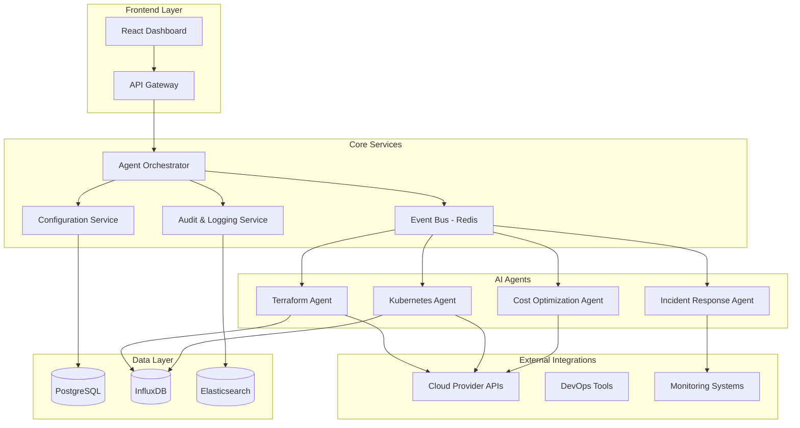

# AIOps Platform Design Document

## Overview

The AIOps Platform is a microservices-based system that combines a React-based dashboard frontend with multiple specialized AI agents running as containerized services. The platform uses event-driven architecture to coordinate between agents and provides real-time monitoring, automated remediation, and comprehensive audit trails for DevOps operations.

The system is designed to be cloud-agnostic while providing deep integrations with major cloud providers (AWS, Azure, GCP) and popular DevOps tools (Terraform, Kubernetes, monitoring systems).

## Architecture

### High-Level Architecture



### Technology Stack

- **Frontend**: React 18 with TypeScript, Material-UI for components
- **Backend**: Node.js with Express, TypeScript
- **AI Agents**: Python with FastAPI, scikit-learn, TensorFlow for ML models
- **Message Queue**: Redis for event bus and caching
- **Databases**: PostgreSQL for configuration, InfluxDB for metrics, Elasticsearch for logs
- **Container Orchestration**: Docker with Kubernetes deployment
- **Authentication**: JWT with OAuth2 integration

## Components and Interfaces

### Frontend Dashboard

**Purpose**: Provides real-time visibility into AI agent activities and system status

**Key Features**:
- Real-time agent status monitoring
- Infrastructure topology visualization
- Incident timeline and resolution tracking
- Cost optimization reports and trends
- Agent configuration management interface

**API Endpoints**:
- `GET /api/agents/status` - Get all agent statuses
- `GET /api/incidents` - Retrieve incident history
- `GET /api/cost-optimization/reports` - Get cost reports
- `POST /api/agents/config` - Update agent configurations

### Agent Orchestrator

**Purpose**: Coordinates AI agent activities and manages workflow execution

**Key Responsibilities**:
- Agent lifecycle management (start, stop, restart)
- Event routing and message distribution
- Conflict resolution between agent actions
- Policy enforcement and approval workflows

**Interfaces**:
```typescript
interface AgentOrchestrator {
  registerAgent(agent: Agent): Promise<void>
  routeEvent(event: SystemEvent): Promise<void>
  enforcePolicy(action: AgentAction): Promise<boolean>
  requestApproval(action: HighRiskAction): Promise<ApprovalResult>
}
```

### Terraform Agent

**Purpose**: Monitors and manages Terraform infrastructure state

**Key Capabilities**:
- Drift detection using state comparison
- Automated plan generation and application
- Resource dependency analysis
- State backup and recovery

**ML Models**:
- Drift prediction model trained on historical state changes
- Risk assessment model for automated vs manual approval
- Resource optimization recommendations

### Kubernetes Agent

**Purpose**: Provides predictive scaling and cluster optimization

**Key Capabilities**:
- Workload pattern analysis and prediction
- Horizontal and vertical pod autoscaling
- Resource quota optimization
- Node utilization balancing

**ML Models**:
- Time-series forecasting for resource demand
- Anomaly detection for unusual scaling patterns
- Cost-performance optimization algorithms

### Incident Response Agent

**Purpose**: Automatically detects, classifies, and resolves common incidents

**Key Capabilities**:
- Multi-source alert correlation
- Incident classification and severity assessment
- Automated runbook execution
- Root cause analysis and documentation

**ML Models**:
- Incident classification using NLP on logs and alerts
- Pattern matching for known incident types
- Success prediction for automated remediation

### Cost Optimization Agent

**Purpose**: Continuously analyzes and optimizes cloud spending

**Key Capabilities**:
- Resource utilization analysis
- Right-sizing recommendations
- Reserved instance optimization
- Waste detection and elimination

**ML Models**:
- Usage pattern analysis for right-sizing
- Cost forecasting and budget optimization
- Anomaly detection for unexpected spending

## Data Models

### Agent Configuration
```typescript
interface AgentConfig {
  id: string
  name: string
  type: AgentType
  enabled: boolean
  automationLevel: 'manual' | 'semi-auto' | 'full-auto'
  thresholds: Record<string, number>
  approvalRequired: boolean
  integrations: Integration[]
  createdAt: Date
  updatedAt: Date
}
```

### System Event
```typescript
interface SystemEvent {
  id: string
  type: EventType
  source: string
  severity: 'low' | 'medium' | 'high' | 'critical'
  data: Record<string, any>
  timestamp: Date
  correlationId?: string
}
```

### Agent Action
```typescript
interface AgentAction {
  id: string
  agentId: string
  type: ActionType
  description: string
  targetResources: string[]
  riskLevel: 'low' | 'medium' | 'high'
  estimatedImpact: string
  status: 'pending' | 'approved' | 'executing' | 'completed' | 'failed'
  executedAt?: Date
  result?: ActionResult
}
```

### Incident Record
```typescript
interface Incident {
  id: string
  title: string
  description: string
  severity: 'low' | 'medium' | 'high' | 'critical'
  status: 'open' | 'investigating' | 'resolved' | 'closed'
  affectedResources: string[]
  detectedAt: Date
  resolvedAt?: Date
  resolutionSteps: string[]
  automatedResolution: boolean
}
```

## Error Handling

### Agent Failure Recovery
- **Circuit Breaker Pattern**: Prevent cascading failures when external services are unavailable
- **Retry Logic**: Exponential backoff for transient failures
- **Fallback Mechanisms**: Graceful degradation when AI models are unavailable
- **Health Checks**: Regular agent health monitoring with automatic restart

### Data Consistency
- **Event Sourcing**: All agent actions recorded as immutable events
- **Compensating Actions**: Rollback mechanisms for failed operations
- **Idempotency**: All agent actions designed to be safely retryable
- **Conflict Resolution**: Priority-based resolution when multiple agents target same resources

### Security and Compliance
- **Audit Trails**: Complete logging of all system actions and decisions
- **Access Control**: Role-based permissions for agent configurations
- **Credential Management**: Secure storage and rotation of cloud credentials
- **Compliance Reporting**: Automated generation of compliance reports

## Testing Strategy

### Unit Testing
- **Agent Logic**: Test individual agent decision-making algorithms
- **ML Models**: Validate model accuracy and performance metrics
- **API Endpoints**: Test all REST API functionality
- **Data Models**: Validate data integrity and relationships

### Integration Testing
- **Agent Coordination**: Test multi-agent workflows and conflict resolution
- **External APIs**: Mock cloud provider and tool integrations
- **Event Processing**: Validate event routing and message handling
- **Database Operations**: Test data persistence and retrieval

### End-to-End Testing
- **Automation Workflows**: Test complete incident response and remediation flows
- **Dashboard Functionality**: Validate UI interactions and real-time updates
- **Performance Testing**: Load testing for high-volume event processing
- **Disaster Recovery**: Test system recovery and data backup procedures

### AI Model Testing
- **Model Validation**: Cross-validation and performance metrics
- **Bias Detection**: Ensure models don't exhibit harmful biases
- **Drift Detection**: Monitor model performance degradation over time
- **A/B Testing**: Compare model versions in production environments