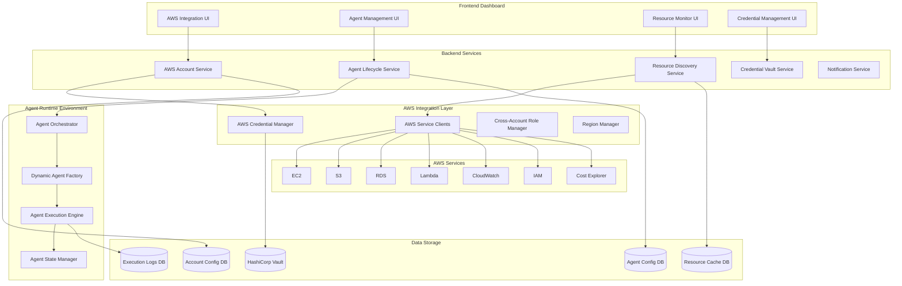

# AWS Integration Dashboard Design Document

## Overview

The AWS Integration Dashboard is a comprehensive web application that provides deep AWS account integration with secure credential management, dynamic agent creation, and real-time agent execution monitoring. This system goes beyond surface-level integration to provide a fully functional AWS management platform with AI-powered automation capabilities.

The dashboard integrates with the existing AIOps platform while providing specialized AWS-focused functionality including multi-account management, cross-region operations, service-specific agents, and comprehensive resource monitoring.

## Architecture

### High-Level Architecture



### Technology Stack

- **Frontend**: React 18 with TypeScript, Material-UI v5, React Query for state management
- **Backend**: Node.js with Express, TypeScript, Prisma ORM
- **AWS Integration**: AWS SDK v3 with credential providers, STS for role assumption
- **Agent Runtime**: Python with FastAPI, Celery for task execution, Redis for queuing
- **Security**: HashiCorp Vault for credential storage, JWT with refresh tokens
- **Database**: PostgreSQL for configuration, Redis for caching and queues
- **Monitoring**: Prometheus metrics, Grafana dashboards, structured logging

## Components and Interfaces

### AWS Account Service

**Purpose**: Manages AWS account connections, credential validation, and multi-account operations

**Key Features**:
- Secure credential storage and validation
- Cross-account role assumption setup
- Multi-region account discovery
- Account health monitoring and alerting
- Automatic credential rotation

**API Endpoints**:
```typescript
POST /api/aws/accounts - Add new AWS account
GET /api/aws/accounts - List all connected accounts
PUT /api/aws/accounts/:id - Update account configuration
DELETE /api/aws/accounts/:id - Remove account connection
POST /api/aws/accounts/:id/validate - Validate account credentials
GET /api/aws/accounts/:id/regions - Get available regions
POST /api/aws/accounts/:id/assume-role - Test role assumption
```

**Data Model**:
```typescript
interface AWSAccount {
  id: string
  name: string
  accountId: string
  credentialType: 'access_key' | 'iam_role' | 'instance_profile'
  regions: string[]
  defaultRegion: string
  roleArn?: string
  externalId?: string
  status: 'active' | 'inactive' | 'error'
  lastValidated: Date
  permissions: AWSPermission[]
  tags: Record<string, string>
  createdAt: Date
  updatedAt: Date
}
```

### Agent Lifecycle Service

**Purpose**: Handles dynamic agent creation, configuration, and lifecycle management

**Key Features**:
- Dynamic agent type discovery and creation
- Agent configuration validation and templating
- Agent deployment and scaling
- Health monitoring and automatic recovery
- Performance metrics and optimization

**API Endpoints**:
```typescript
GET /api/agents/types - Get available agent types
POST /api/agents - Create new agent instance
GET /api/agents - List all agent instances
PUT /api/agents/:id - Update agent configuration
DELETE /api/agents/:id - Delete agent instance
POST /api/agents/:id/start - Start agent execution
POST /api/agents/:id/stop - Stop agent execution
POST /api/agents/:id/restart - Restart agent
GET /api/agents/:id/status - Get agent status
GET /api/agents/:id/logs - Get agent execution logs
GET /api/agents/:id/metrics - Get agent performance metrics
```

**Data Model**:
```typescript
interface AgentInstance {
  id: string
  name: string
  type: AgentType
  accountId: string
  region: string
  configuration: AgentConfiguration
  status: 'stopped' | 'starting' | 'running' | 'stopping' | 'error'
  lastExecution: Date
  nextExecution?: Date
  executionCount: number
  successRate: number
  averageExecutionTime: number
  resources: ResourceRequirements
  createdAt: Date
  updatedAt: Date
}
```

### Resource Discovery Service

**Purpose**: Discovers, monitors, and caches AWS resources across accounts and regions

**Key Features**:
- Automated resource discovery across all AWS services
- Real-time resource monitoring and change detection
- Resource relationship mapping and dependency analysis
- Cost tracking and optimization recommendations
- Compliance and security scanning

**API Endpoints**:
```typescript
GET /api/resources - List discovered resources with filtering
GET /api/resources/:id - Get detailed resource information
POST /api/resources/discover - Trigger resource discovery
GET /api/resources/topology - Get resource topology map
GET /api/resources/costs - Get cost analysis
GET /api/resources/compliance - Get compliance status
```

### Credential Vault Service

**Purpose**: Securely manages AWS credentials with encryption, rotation, and audit trails

**Key Features**:
- AES-256 encryption for credential storage
- Automatic credential rotation with configurable schedules
- Audit logging for all credential access
- Integration with HashiCorp Vault
- Emergency credential revocation

**API Endpoints**:
```typescript
POST /api/credentials - Store new credentials
PUT /api/credentials/:id - Update credentials
DELETE /api/credentials/:id - Delete credentials
POST /api/credentials/:id/rotate - Rotate credentials
GET /api/credentials/:id/audit - Get credential audit log
POST /api/credentials/:id/test - Test credential validity
```

## Data Models

### Agent Configuration Schema
```typescript
interface AgentConfiguration {
  triggers: {
    schedule?: CronExpression
    events?: EventTrigger[]
    thresholds?: ThresholdTrigger[]
  }
  parameters: {
    [key: string]: {
      type: 'string' | 'number' | 'boolean' | 'array' | 'object'
      value: any
      required: boolean
      validation?: ValidationRule[]
    }
  }
  resources: {
    cpu: number
    memory: number
    timeout: number
    retries: number
  }
  permissions: {
    awsActions: string[]
    resourceArns: string[]
    conditions?: IAMCondition[]
  }
  notifications: {
    onSuccess?: NotificationConfig[]
    onFailure?: NotificationConfig[]
    onThreshold?: NotificationConfig[]
  }
}
```

### AWS Resource Model
```typescript
interface AWSResource {
  id: string
  arn: string
  accountId: string
  region: string
  service: string
  resourceType: string
  name: string
  tags: Record<string, string>
  properties: Record<string, any>
  relationships: ResourceRelationship[]
  costs: CostData
  compliance: ComplianceStatus
  lastUpdated: Date
  discoveredAt: Date
}
```

### Execution Log Model
```typescript
interface ExecutionLog {
  id: string
  agentId: string
  executionId: string
  startTime: Date
  endTime?: Date
  status: 'running' | 'completed' | 'failed' | 'cancelled'
  trigger: ExecutionTrigger
  actions: ExecutionAction[]
  metrics: ExecutionMetrics
  errors?: ExecutionError[]
  artifacts?: ExecutionArtifact[]
}
```

## Security Architecture

### Credential Management
- **Encryption at Rest**: All credentials encrypted using AES-256 with customer-managed keys
- **Encryption in Transit**: TLS 1.3 for all API communications
- **Access Control**: Role-based access with principle of least privilege
- **Audit Logging**: Complete audit trail for all credential operations
- **Rotation**: Automated credential rotation with zero-downtime updates

### AWS Permissions Model
```typescript
interface AWSPermissionSet {
  name: string
  description: string
  policies: {
    managed: string[]  // AWS managed policy ARNs
    inline: IAMPolicyDocument[]  // Custom inline policies
  }
  conditions: {
    ipRestrictions?: string[]
    timeRestrictions?: TimeWindow[]
    mfaRequired?: boolean
  }
  resources: {
    allowed: string[]  // Resource ARN patterns
    denied?: string[]  // Explicitly denied resources
  }
}
```

### Cross-Account Role Management
```typescript
interface CrossAccountRole {
  roleArn: string
  externalId: string
  trustPolicy: IAMPolicyDocument
  permissionBoundary?: string
  sessionDuration: number
  conditions: AssumeRoleCondition[]
}
```

## Agent Types and Capabilities

### Cost Optimization Agent
**Capabilities**:
- Right-sizing EC2 instances based on utilization metrics
- Identifying and terminating unused resources
- Reserved Instance optimization recommendations
- S3 storage class optimization
- Lambda function optimization

**Configuration Parameters**:
```typescript
interface CostOptimizationConfig {
  utilizationThreshold: number  // CPU utilization threshold (0-100)
  lookbackPeriod: number       // Days to analyze (7-90)
  savingsThreshold: number     // Minimum savings to trigger action ($)
  autoApprove: boolean         // Auto-approve low-risk optimizations
  excludedResources: string[]  // Resource ARNs to exclude
  notifications: {
    dailyReport: boolean
    weeklyReport: boolean
    immediateAlerts: boolean
  }
}
```

### Security Compliance Agent
**Capabilities**:
- Security group rule analysis and optimization
- IAM policy analysis and least privilege recommendations
- S3 bucket security configuration validation
- CloudTrail log analysis for suspicious activities
- Compliance framework validation (SOC2, PCI-DSS, HIPAA)

### Resource Lifecycle Agent
**Capabilities**:
- Automated resource tagging and organization
- Lifecycle policy enforcement
- Backup and snapshot management
- Resource cleanup based on age and usage
- Environment-specific resource management

### Performance Monitoring Agent
**Capabilities**:
- Real-time performance metric collection
- Anomaly detection and alerting
- Auto-scaling recommendations
- Performance bottleneck identification
- SLA monitoring and reporting

## Error Handling and Recovery

### Circuit Breaker Pattern
```typescript
interface CircuitBreakerConfig {
  failureThreshold: number     // Number of failures before opening
  recoveryTimeout: number      // Time before attempting recovery
  monitoringWindow: number     // Time window for failure counting
  fallbackStrategy: 'retry' | 'skip' | 'alert'
}
```

### Retry Logic
```typescript
interface RetryConfig {
  maxAttempts: number
  backoffStrategy: 'exponential' | 'linear' | 'fixed'
  baseDelay: number
  maxDelay: number
  jitter: boolean
  retryableErrors: string[]
}
```

### Disaster Recovery
- **Data Backup**: Automated daily backups of all configuration data
- **Multi-Region Deployment**: Active-passive deployment across AWS regions
- **Failover Automation**: Automatic failover with health checks
- **Recovery Testing**: Monthly disaster recovery testing procedures

## Performance and Scalability

### Caching Strategy
- **Resource Cache**: Redis-based caching for AWS resource data (TTL: 5 minutes)
- **Credential Cache**: In-memory credential caching with automatic refresh
- **Query Result Cache**: Database query result caching for dashboard data
- **CDN Integration**: CloudFront for static asset delivery

### Horizontal Scaling
- **Agent Execution**: Kubernetes-based auto-scaling for agent workloads
- **API Services**: Load-balanced API services with health checks
- **Database Scaling**: Read replicas for query performance
- **Queue Processing**: Celery workers with auto-scaling based on queue depth

### Monitoring and Observability
```typescript
interface MetricsCollection {
  system: {
    cpu: number
    memory: number
    disk: number
    network: number
  }
  application: {
    requestRate: number
    errorRate: number
    responseTime: number
    activeConnections: number
  }
  business: {
    agentsRunning: number
    accountsConnected: number
    resourcesManaged: number
    costSavings: number
  }
}
```

## Testing Strategy

### Unit Testing
- **Service Layer**: 90%+ code coverage for all business logic
- **Integration Layer**: Mock AWS services for consistent testing
- **UI Components**: React Testing Library for component testing
- **Agent Logic**: Isolated testing of agent decision algorithms

### Integration Testing
- **AWS Integration**: Localstack for AWS service mocking
- **Database Integration**: Test containers for database testing
- **API Testing**: Supertest for endpoint testing
- **Agent Coordination**: Multi-agent workflow testing

### End-to-End Testing
- **User Workflows**: Cypress tests for complete user journeys
- **Agent Execution**: Full agent lifecycle testing
- **Multi-Account Scenarios**: Cross-account operation testing
- **Performance Testing**: Load testing with realistic data volumes

### Security Testing
- **Penetration Testing**: Quarterly security assessments
- **Vulnerability Scanning**: Automated dependency scanning
- **Credential Security**: Encryption and access control testing
- **Compliance Validation**: Automated compliance checking